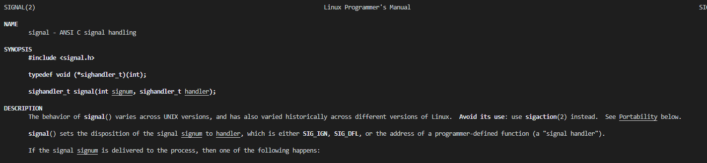
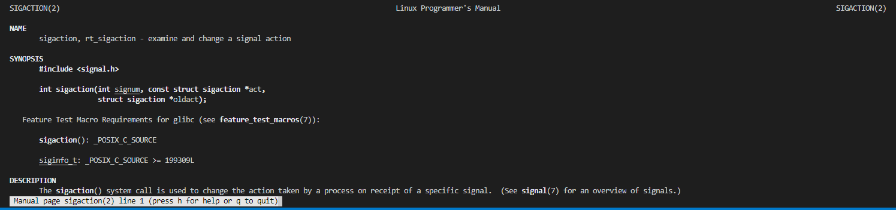

# Answers

## 3

### a)

Como vemos na foto, é recomendado o uso de sigaction em vez de signal devido à função signal ter diferentes comportamentos dependendo da versão de UNIX()

### b)

Como vemos na foto, os parâmetros são signum,act e oldact.
Signum especifica o sinal e pode ser qualquer sinal exceto SIGKILL e SIGSTOP.
Se act for não nulo, a nova açaõ do sinal signum é instalada do act.
Se oldact for não nulo, a ação anterior é salva no oldact.

### c)

File `Answer.c`

### d)

Variaveis estaticas não é possivel usar num handler, quanto a variaveis globais pode-se usar desde que sejam volatile sig_atomic_t.

### e)

Funções pertencentes ao standard POSIX.1, ou seja, funções que não são interrompidas pelo signal-handler.
